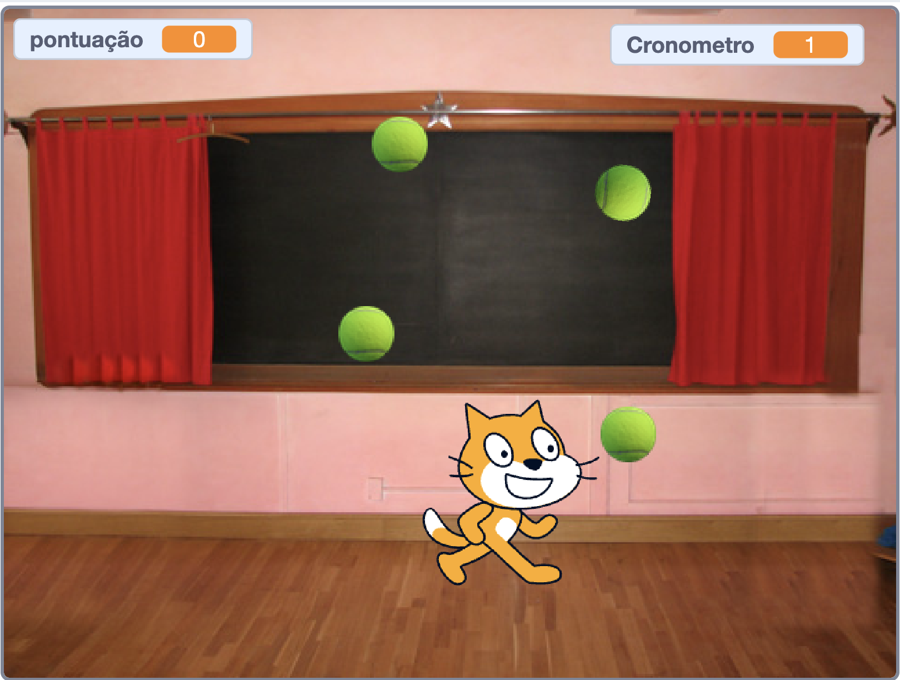

# Projeto Scratch - Jogo de pegar bolinhas

## Link do projeto:
https://scratch.mit.edu/projects/723170497/

### Lista de requisitos

- [ ] O jogo deve ter um cenário.
- [ ] O jogo deve ser iniciado ao clicar na bandeira verde.
- [ ] O jogo deve ter um personagem (um ator qualquer) que se mova nas 4 direções utilizando o teclado.
- [ ] O jogo deve ter 4 outros atores iguais (cumprindo o papel das bolinhas, mas não precisam ser bolinhas) deslizando pela tela aleatoriamente.
- [ ] O jogo deve ter uma variável para contar a pontuação. Essa variável deve estar como 0 quando o jogo começar.
- [ ] Quando o personagem principal encosta em alguma das 4 bolinhas, a bolinha encostada deve sumir.
- [ ] Quando o personagem principal encosta em alguma das 4 bolinhas, a pontuação deve ser somada em 1.
- [ ] O jogo deve ter uma variável que guarda o tempo do jogo, em segundos. O tempo deve começar o jogo em 0.
- [ ] O jogo deve terminar quando o personagem principal pegar as 4 bolinhas. Nesse caso, mostrar uma mensagem de vitória.
- [ ] O jogo deve terminar quando o tempo chega em 30 segundos. Nesse caso, mostrar uma mensagem de derrota.

### Instruções de entrega

- Baixe o arquivo do scratch para o seu computador
   

      
Não sabe como fazer?

      
   

- Faça o fork desse repositório e realize o clone da sua cópia `seu-nome-de-usuario/projeto-scratch`.
- Adicione o arquivo baixado a uma pasta na raiz do seu repositório local
   

   
Quer uma dica?

   
   

   
- Execute o fluxo de entrega do git. **Lembre-se de abrir o PR para seu próprio repositório.**
    

       
Dúvidas sobre o Git & Github?

       
Adiciomos um vídeo explicando o <strong>processo de entrega</strong> [do fork ao pull request] no Material Assincrono da <a href="https://classroom.google.com/w/NTM0NjA2NDg3MjIx/tc/NTM2NDg5NTQyODg4">A005 - Git e Github</a>. Esse vídeo também exemplifica situações que podem acontecer durante o fluxo de utilização do Git.

    

    
- Compartilhe o projeto de Scratch e copie o link
   

      
Não sabe como fazer?

      
   <video src="https://user-images.githubusercontent.com/11279432/185605527-a2729068-bbc0-4e6a-b1ba-a0203967fdea.mov" />

   

    
- Entregue o **link do projeto de Scratch** e o **link do PR** no [Formulário de entrega](https://forms.gle/makgC56MrUSNX8RY8). **Ainda não faça o merge!**
   

      
Ajuda pra saber onde achar o link do PR?

      

         Ao gerar o Pull Request, copie a url que estará no navegador e vai se parecer com isso: <code>https://github.com/seu-nome-de-usuario/projeto-scratch/pull/1</code>
      

   

- **O retorno do projeto será comentado no PR**, comunicaremos nos canais de anúncio quando todos estiverem feitos. A partir dai, **vocês poderão mergear a branch de trabalho com a branch principal**.
